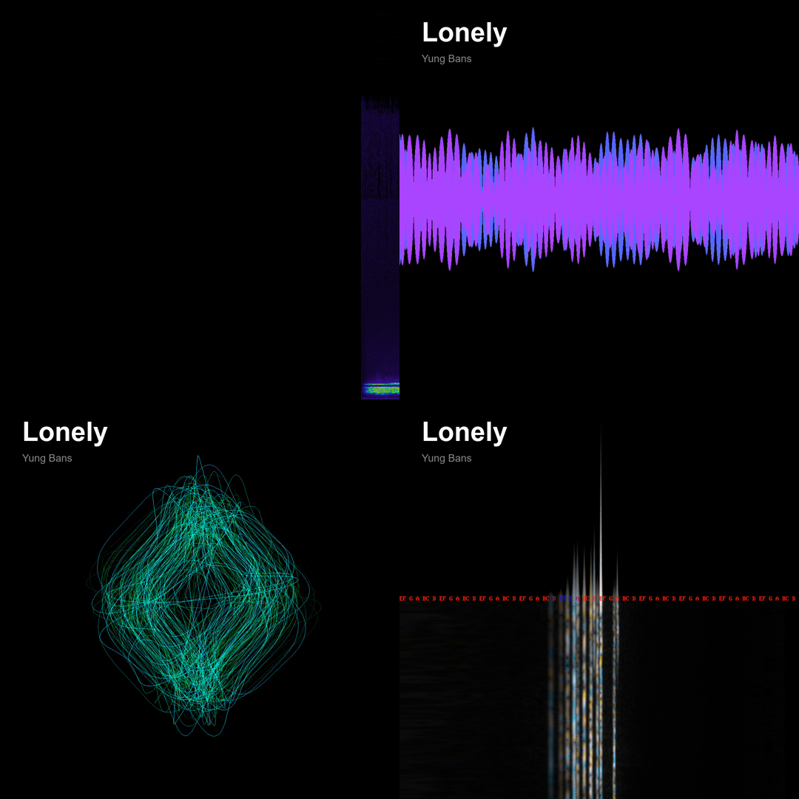

# pi-dj 🎧

AI music production suite for [pi](https://github.com/badlogic/pi-mono).

Stream YouTube, generate AI music with Suno, live-stream Lyria RealTime, download SoundCloud, Bandcamp & BandLab, mix, trim, BPM-detect, and render music videos — all from your terminal.


## Install

```bash
pi install npm:pi-dj
```

## Platforms

| Platform | Status |
|----------|--------|
| Windows (Git Bash) | ✅ |
| macOS | ✅ |
| Linux | ✅ |
| Raspberry Pi | ✅ |
| Termux (Android) | ✅ |

## Dependencies

You don't need everything — the extension detects what's installed and degrades gracefully.

**Windows**
```bash
winget install mpv
pip install yt-dlp
winget install ffmpeg
```

**macOS**
```bash
brew install mpv yt-dlp ffmpeg
```

**Linux / Raspberry Pi**
```bash
sudo apt install mpv ffmpeg -y
pip install yt-dlp
```

**Termux (Android)**
```bash
pkg install mpv ffmpeg python
pip install yt-dlp
```

## Commands

### Playback
| Command | Description |
|---------|-------------|
| `/dj-play <query\|url>` | YouTube search, URL, or playlist → stream via mpv |
| `/pause` | Toggle pause/resume |
| `/stop` | Stop playback + clear queue |
| `/np` | Now playing — title, time, progress bar |
| `/vol <0-100>` | Set volume |
| `/skip` | Skip to next in queue |
| `/repeat` | Toggle repeat current track |
| `/queue <query\|url>` | Add to playback queue |
| `/history` | Recently played tracks |

### Downloads
| Command | Description |
|---------|-------------|
| `/sc <url>` | Download SoundCloud track → MP3 |
| `/bandcamp <url>` | Download Bandcamp track/album → MP3 |
| `/bandlab <url>` | Download BandLab track/album/collection → MP3 |

### AI Generation
| Command | Description |
|---------|-------------|
| `/dj [1-9\|chill\|beats\|…]` | Lyria RealTime AI radio — live generative stream |

> Requires [lyria-cli](https://github.com/cjpais/lyria-cli) installed. Delegates to cliamp's Lyria integration.

### Production Tools
| Command | Description |
|---------|-------------|
| `/mix <a> <b> [secs]` | Crossfade two tracks with ffmpeg |
| `/trim <file> <start> [end]` | Trim audio clip |
| `/bpm <file>` | Detect BPM |
| `/render <file\|url> [style]` | Render music video with ffmpeg visualizer |

### Render Styles

`/render` produces a 1080×1080 MP4 with animated visualizer + track title/artist overlay. No extra dependencies — pure ffmpeg.



| Style | Filter | Description |
|-------|--------|-------------|
| `bars` (default) | `showspectrum` | Frequency spectrum bars |
| `wave` | `showwaves` | Waveform |
| `circle` | `avectorscope` | Lissajous circle |
| `cqt` | `showcqt` | Constant-Q transform |

```
/render ~/Music/track.mp3          → bars style
/render ~/Music/track.mp3 wave     → waveform
/render https://youtu.be/xxx cqt   → downloads first, then renders
```

Output: `~/Music/Videos/<title>_<style>.mp4`

### Help
| Command | Description |
|---------|-------------|
| `/dj-help` | Show all commands + tool availability |

## LLM Tools

The extension registers two tools the AI can call directly:

| Tool | Description |
|------|-------------|
| `dj_play_music` | Stream a YouTube URL or search query |
| `dj_queue_music` | Add a track to the queue |

## Division of Labour

| Extension | Owns |
|-----------|------|
| `cliamp` | Local files, HTTP streams, Lyria AI radio (`/play`, `/music`, `/radio`) |
| `pi-djvj` | Terminal audio-reactive visualizer + WebGL shaders (`/viz`, `/djvj`) |
| `pi-dj` | YouTube streaming, AI downloads, production tools (this) |

## License

MIT
